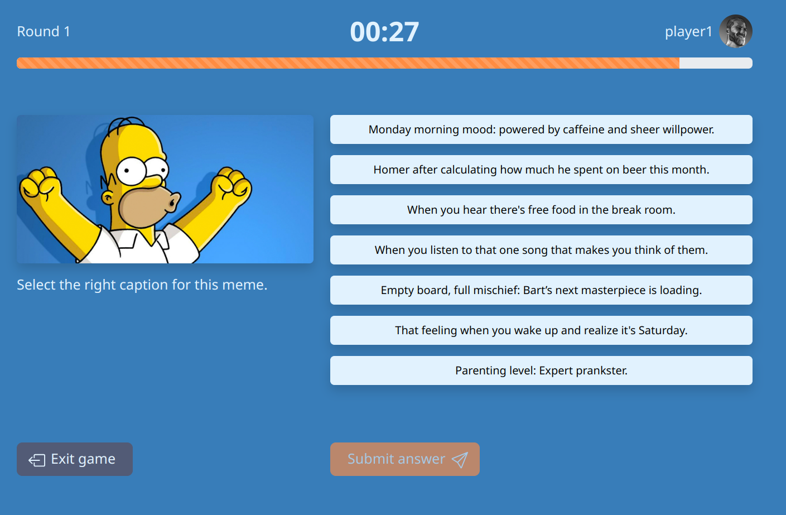
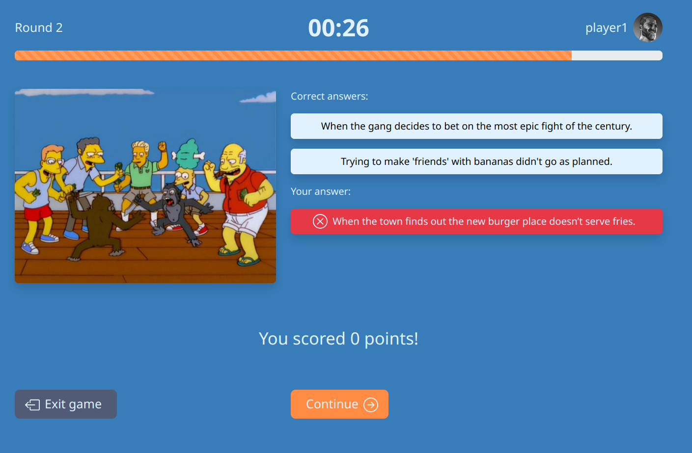

[](https://classroom.github.com/a/J0Dv0VMM)

# Exam #1: "Gioco dei Meme"

## Student: s323287 PALAZZI FEDERICO

## React Client Application Routes

- Route `/`: `App` component contains the homepage of the game and various buttons to move across the application.
- Route `/play/guest`: `GuestPage` is accessible by any unauthenticated users in order to try the game for only one round.
- Route `/play?category`: `GamePage` is similar to GuestPage, but supports the full game experience with three different rounds for the same game and a final recap of the match.
- Route `/auth`: `AuthPage` allows unauthenticated users to either create an account, or login to an existing one.
- Route `/profile`: `ProfilePage` contains information about the currently logged in user and a scoreboard of his previous games.
- Route `*` : `NotFound` is a component displayed when the URL does not match any of the previous routes.

## API Server

### UserRoutes

- POST `/api/users`

  - request body

    ```json
    {
        "username": "player1",
        "password": "12345"
    }
    ```

  - response: `200 OK`

### AuthRoutes

- POST `/api/sessions`
  - request body

    ```json
    {
        "username": "player1",
        "password": "12345"
    }
    ```

  - response body

    ```json
    {
       	"id": 1,
        "username": "player1",
        "points": 30,
        "avatar": {
            "id": 2,
            "name": "avatar1.png",
            "value": 10
        }
    }
    ```

- GET `/api/sessions/current`

  - response body

    ```json
    {
       	"id": 1,
        "username": "player1",
        "points": 30,
        "avatar": {
            "id": 2,
            "name": "avatar1.png",
            "value": 10
        }
    }
    ```

- DELETE `/api/sessions/current`

  - response: `200 OK`

### AvatarRoutes

- GET `/api/avatars`

  - response body

    ```json
    [
        {
            "id": 2,
            "name": "avatar1.png",
            "value": 10
        },
        {...}
    ]
    ```

- PUT `/api/avatars/:avatarId`

  - response: `200 OK`

### GameRoutes

- GET `/api/games/new?category`

  - response body:

    ```json
    [
        {
            "memeId": 1,
            "memeURL": "/memes/simpson/meme1.jpeg"
            "captions": [
            	{
                	"id": 1,
            		"text": "Caption 1"
    			},
        		{...}
            ]
        },
    	{...}
    ]
    ```

- POST `/api/games`

  - request body

    ```json
    {
        "rounds": [
            {
                "memeId": 1,
                "score": 5
            },
            {...}
        ]
    }
    ```

  - response: `200 OK`

- GET `/api/games`

  - response body

    ```json
    [
        {
            "date": "2024-06-27",
            "memes": [
                {
                    "id": 1,
                    "name": "meme1.jpeg",
                    "category": "simpson",
                    "captions": []
                },
                {
                    "id": 2,
                    "name": "meme2.jpeg",
                    "category": "griffin",
                    "captions": []
                },
                {
                    "id": 3,
                    "name": "meme3.jpeg",
                    "category": "simpson",
                    "captions": []
                }
            ],
            "scores": [0, 5, 0]
        }
    ]
    ```

- POST `/api/games/validate`

  - request body

    ```json
    {
        "memeId": 1,
        "captionsIds": [1,2,3,4,5,6,7],
        "answerId": 2
    }
    ```

  - response body

    ```json
    {
      	"validCaptions": [
            {
                "id": 1,
                "text": "Caption 1"
            },
            {
                "id": 2,
                "text": "Caption 2"
            }
        ],
        "isValid": true,
        points: 5
    }
    ```

    

## Database Tables

- Table `memes` - contains `id`, `name`, `category`
- Table `captions` - contains `id`, `text`
- Table `memes_captions` - contains `memeId`, `captionId`
- Table `avatars` - contains `id`, `name`, `value`
- Table `users` - contains `id`, `username`, `password`, `salt`, `points`, `avatar`
- Table `games` - contains `id`, `userId`, `date`, `meme1`, `score1`, `meme2`, `score2`, `meme3`, `score3`

## Main React Components

- `AvatarsModal` (in `AvatarsModal.jsx`): this component displays a list of avatars that can be chosen by authenticated users if they have gained enough points in the game.
- `CaptionsList` (in `CaptionsList.jsx`): this component renders a list of Caption components in order to allow the user to select the valid caption.
- `Game` (in `Game.jsx`): this component contains all the elements displayed during a game round and communicates with GuestPage and GamePage to exchange data, switch round and terminate the game.
- `GameReview` (in `GameReview.jsx`): this component displays a final review of the game that just ended. It shows to the user which memes he correctly guessed and how many points he scored.
- `Timer` (in `Timer.jsx`): this component keeps track of the time during the game and displays a countdown value. After 30 seconds, if the user hasn't submitted an answer, it terminates the round.

## Screenshot





## Users Credentials

- username: `player1`, password: `12345`
- username: `player2`, password: `12345` 
